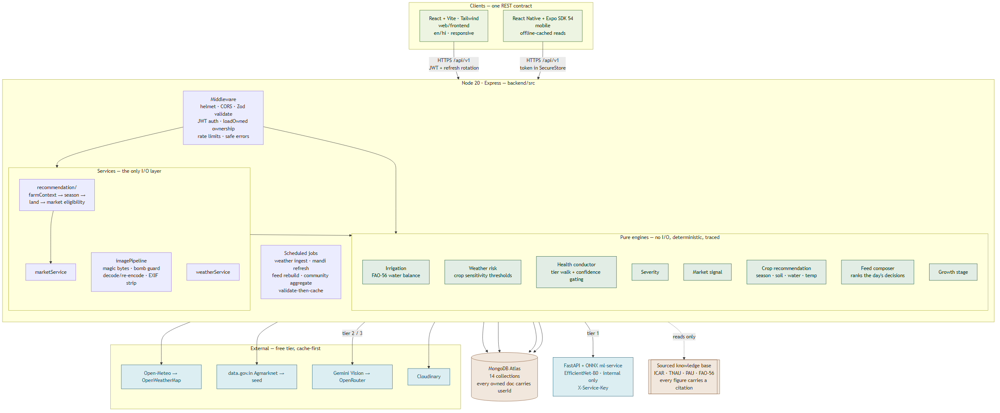

# 🌾 Khetri — Smart Farm Decision Support System

> *HackInMotion 2026 · Team HIM-1096.*
> **STATUS: ALL 9 MUST-HAVES COMPLETE ON WEB + ANDROID. NOT DEPLOYED.** All nine must-have requirements are built and tested on both clients. Of the six *challenge* capabilities, **4 are complete, 1 is partial and 1 is not built** — mobile voice **input** is deliberately absent (`RECORD_AUDIO` would forfeit the Expo Go demo route) and **yield prediction is not built at all**, because the district yield lookup it needs does not exist and we will not ship invented coefficients. The per-item breakdown is in [`docs/development/submission-audit.md`](docs/development/submission-audit.md) §2. *(This line previously read "all six challenge capabilities are built and tested", which was wrong — corrected 2026-08-14.)* **Phase 8 (deploy & seed) is deliberately left open until the qualifier result is announced** — provisioning Render/Vercel/Atlas/HF-Spaces accounts and burning their free-tier windows before we know we have qualified is waste, not progress. Everything Phase 8 needs is committed and locally verified: `render.yaml` with every secret `sync: false`, the environment checklist, and a smoke suite that passes 18/18 against a local `NODE_ENV=production` server on a real database.
>
> **Verified 2026-08-14, from real runs:**
>
> | Suite | Result |
> |---|---|
> | Backend API | **1,566 / 1,566** |
> | React web client | **131 / 131** |
> | Expo Android client | **110 / 110** |
> | ml-service (FastAPI + ONNX) | **143 pass / 1 known pre-existing failure** |
> | Gates | lint 0 errors · both typechecks clean · i18n parity (0 missing in hi) · 0 hardcoded user-facing strings · Gitleaks clean · production build green |
>
> **Still owed, and not claimed:** the Render/Vercel deploy, the EAS APK build, and every device- and demo-day verification that depends on them. The 17-row manual device matrix in `docs/mobile/testing.md` has zero executed rows — no phone has run the app.
>
> The one failing ml-service test is `test_generator_reports_the_committed_manifest_as_current`: `ml-service/model/model-manifest.json` records a `datasetManifest.sha256` that does not match the committed `datasets/manifest.json`. Both files are unchanged since the Phase-4 commit `29543d1`, so the drift was committed there — it is not a regression, and it is deliberately left for the ML owner rather than silently regenerated, because regenerating a model manifest rewrites recorded metrics.

*"A farmer's biggest risk isn't hard work — it's making the wrong decision at the wrong time."*

## Evaluator quick overview

*Thirteen lines, then the detail. Every claim below is checkable in this repository.*

| | |
|---|---|
| **Problem** | A farmer makes five high-stakes decisions a season — plant what, irrigate when, react to weather, is the crop sick, sell when. The data exists; it is scattered, wrong-language, wrong-moment. |
| **Solution** | One field profile drives every answer. Open the app → *"what do I act on today?"* |
| **Core innovation** | **Evidence-aware decision support.** When a factor has no data behind it the system **drops it and says so** rather than substituting a neutral value — and reports `evidenceRatio`, the share of the intended weight actually backed by data. |
| **Architecture** | React (web) + React Native/Expo (Android) → Node 20/Express → MongoDB → FastAPI+ONNX. **8 pure engines** with no I/O, each returning its own `trace`. |
| **AI/ML** | EfficientNet-B0 trained on our own GPU, 39,960 images / 36 classes, temperature-calibrated. Four-tier fallback: local ONNX → Gemini → OpenRouter → symptom rules. **The model never authors advice** — it returns a code; the text comes from a sourced KB. |
| **Impact** | Personalization is structural, not cosmetic: change the soil type and the irrigation verdict changes, because soil water-holding is an input to the FAO-56 balance. |
| **Security** | 15 real vulnerabilities found and fixed, **each with a regression test that fails against the pre-fix code**. ZAP baseline 0 FAIL / 66 PASS. Ownership is a query filter — another farmer's field is a **404, not a 403**. |
| **Evidence** | ~1,950 tests: backend **1,566** · web **131** · Android **110** · ml-service **143**. |
| **Limitations** | **Not deployed.** No APK built, no phone has run the app. Field-domain model accuracy is **0.1257** (we measured it and publish it). Full honest list: [`docs/development/submission-audit.md`](docs/development/submission-audit.md). |

**Start here:** [`docs/development/submission-audit.md`](docs/development/submission-audit.md) — our own audit against the brief, including what we did *not* finish.

---

## Why Khetri is different

Thirteen things this system does that a weekend CRUD app does not. Each names the
file that implements it, so none of this has to be taken on trust.

**1 · Evidence-aware scoring — the one to look at first.**
The crop recommender weights four factors (season 0.30 · soil 0.25 · water 0.30 ·
temp 0.15). When a factor has no published data for that farm, it is **excluded
and the remaining weights renormalised** — never filled with a neutral 0.5. The
response carries `evidenceRatio` so a crop ranked on two factors is not silently
presented as equal to one ranked on four.
→ `backend/src/engines/cropRec/cropRecommendation.js`

**2 · Farm-scoped recommendations.** *What:* ranked for the actual field.
*Why:* generic advice ignores free land, standing crops and reachable buyers.
*How:* `FarmContext → SeasonResolver → LandAvailability → MarketEligibility → scoring`.
*Evidence:* the detail screen re-runs the identical pipeline and **selects** a crop
from its result, so a card and the page it opens cannot disagree about the score.
→ `backend/src/services/recommendation/`

**3 · Market eligibility as a hard gate.** A crop no reachable mandi has priced is
**excluded with a stated reason**, never ranked with an empty price column — a
recommendation you cannot price is one you cannot act on.
→ `backend/src/services/recommendation/marketEligibility.js`

**4 · FAO-56 irrigation, not "it might rain".** ET₀ × crop coefficient for the
derived growth stage, against soil available-water and stage-adjusted root depth,
replayed over the logged ledger and projected across the forecast.
→ `backend/src/engines/irrigation/computeIrrigation.js`

**5 · Freshness on every data-bearing surface.** `live` · `cached` · `historical` ·
`pending`. A farm whose grid cell has never been fetched returns a **designed
pending state**, not a 500.
→ `web/frontend/src/components/ui/FreshnessDot.tsx`

**6 · Transparent decision traces.** Every engine returns the numbers behind its
verdict, and the UI shows them **on the page** rather than behind a disclosure
nobody opens.
→ `web/frontend/src/components/domain/IrrigationWorking.tsx`

**7 · Crop-health fallback chain.** local ONNX → Gemini → OpenRouter → symptom
rules. Every tier that declines is recorded in `escalationPath` **with its reason**
and shown to the farmer. The terminal tier is local, so the chain always answers.
→ `backend/src/services/cropHealthService.js`

**8 · The model never writes advice.** It returns a disease code and a confidence.
Farmer-facing text comes from a sourced TNAU/ICAR knowledge base by i18n key.
**No AI-authored dosage exists anywhere in this product.**

**9 · Security-first backend.** Ownership applied **inside the query**, never after.
Rotating refresh tokens with reuse detection. Uploads: magic-byte sniff → bomb
guard → full re-encode (**EXIF and GPS stripped**). No admin surface, no demo bypass.
→ `docs/security/phase-7-scorecard.md`

**10 · Bilingual, farmer-first UX.** 1,493 keys, **0 missing in Hindi**, parity
gated. **Zero hardcoded user-facing strings**, enforced by a repo script.
→ `scripts/check-i18n.mjs`, `scripts/check-ui-strings.mjs`

**11 · Web + native Android on one REST contract.** No duplicated business logic —
engines stay server-side, translations and wire types come from `shared/`.

**12 · Offline resilience, reads *and* the field write.** Cached reads survive a
dead connection and are **labelled as cached**, never passed off as fresh. The
one write a farmer makes standing in a field — a watering — is **queued locally
and replayed on reconnect**, safely: each carries a `clientRequestId` the server
dedupes on, so a re-delivery collapses to one row while two genuine waterings on
the same day both persist. Queued entries render **dashed and labelled pending**,
never merged into accepted history.
→ `shared/client/irrigationOutbox.ts`

**13 · Community aggregation that cannot be gamed.** District-aggregated,
consent-gated, structurally PII-free — and there is **no write API**. Only a
scheduled job counting ≥3 distinct farmers can raise an alert.
→ `docs/community/community-alerts.md`

**What ties these together:** every one is a refusal to show a farmer a number we
cannot stand behind. That is the product.

---

## The problem
Indian small and mid-sized farmers make five recurring, high-stakes decisions — what to plant, when to irrigate, how to respond to weather, whether a crop is diseased, and when to sell — with fragmented information and no tool that turns data into personalized, timely, explainable guidance in their language.

## The solution
A web + Android platform where a farmer sets up their farm (location, size, soil, crops) and gets one prioritized answer to *"what do I act on today?"* — powered by:
- **FAO-56 water-balance irrigation engine** — real agronomy (ET₀ × crop coefficient × soil water holding), not "it might rain."
- **Custom-trained crop-disease vision model** (EfficientNet-B0, trained on our own GPU; rice model trained on real Indian field photos) with calibrated confidence — and an honest four-tier fallback: local model → Gemini Vision → OpenRouter → guided symptom assessment. All four verified live on a real field photograph on 2026-08-14 (`docs/development/submission-audit.md` §3c), including the case that matters most: when every tier fails the app answers `UNKNOWN`, never a guess.
- **Mandi price intelligence** from government Agmarknet data — trends and signals, never fake predictions.
- **Crop recommendation + fertilizer guidance** from source-cited ICAR/TNAU/PAU knowledge — every number carries its source; no AI-invented dosages, ever.
- **Full Hindi + English**, voice readout, community outbreak alerts (privacy-first), offline-cached reads.
- **Cache-first resilience:** the app keeps working — labeled honestly — when any external API dies.

## Why it matters
Personalization is structural (change your soil type and watch the irrigation verdict change); every recommendation shows its "why" with real numbers; every data card shows freshness (● Live / ● Cached / ● Historical / ● Local AI / ● AI-assisted). Trust through transparency, built for low digital literacy (≤2 taps to a verdict, icon+color+text, big targets, voice).

## Architecture


`architecture-diagram.png` is rendered from `architecture-diagram.mmd` (kept as source so the diagram is reviewable in a diff):
```bash
npx --yes @mermaid-js/mermaid-cli -i architecture-diagram.mmd -o architecture-diagram.png -b white -w 2400
```
Narrative: `docs/architecture/overview.md`.
React (Vercel) + React Native/Expo (Android) → Express API (Render; JWT + refresh rotation, ownership enforcement, rate limits) → MongoDB Atlas → FastAPI + ONNX ml-service (internal). Jobs ingest weather (Open-Meteo→OpenWeatherMap) and mandi prices (data.gov.in→cache→seed) with validate-then-cache; engines are pure, tested functions.

## Custom ML (honest summary)
Datasets: PlantVillage subsets, Mendeley field chilli sets, SAR-CLD cotton (audit-gated), and a CC BY 4.0 Odisha rice set — **Paddy Doctor was rejected** on licence grounds (paid-subscription access, no published image licence) and replaced. PlantDoc is held out entirely as a field-domain test set. After deduplication and source-stratified splitting: **39,960 unique images, 36 classes**. Unified EfficientNet-B0 with crop-aware masking and temperature-calibrated confidence.

Metrics, from committed artifacts only (`docs/ml/evaluation-results/`, `ml-service/training/`):

| | |
|---|---|
| Best validation macro-F1 | **0.9556** |
| Calibration | T = **0.5863**, ECE 0.0837 → **0.0042** |
| Shipped thresholds | τ = 0.70 · τ_healthy = 0.80 (recorded policy override, re-validated against all 6 documented criteria) |
| Ship gates | **5 / 5 pass** |
| ONNX parity | max \|Δprob\| **1.55e-05** over 100 golden images, 0 argmax mismatches |
| In-domain test accuracy | **0.9632** |
| **Field-domain (PlantDoc) accuracy** | **0.1257** |

That last row is the number most projects omit. A model at 0.96 in-domain scores **0.13** on real field photographs, so the Gemini Vision tier is load-bearing for actual farmer photos rather than a decorative fallback — and rice's perfect healthy/brown-spot separation is a background-shortcut signature, not evidence of skill. Known limitations are documented in `docs/ml/` and stated in our pitch.

## Third-party services (all free, no credit card — research & justification in docs)
| Service | Role | Why chosen | Doc |
|---|---|---|---|
| Open-Meteo | weather + FAO ET₀ | free, keyless, only free source with ET₀ (powers the irrigation engine) | docs/weather/ · ADR-007 |
| OpenWeatherMap | weather fallback | ubiquitous free tier | 〃 |
| data.gov.in (Agmarknet) | mandi prices | official govt source, GODL license | docs/market/ |
| Gemini Flash (`gemini-flash-latest`) | vision second-opinion / general-crop analysis | best free multimodal tier (1,500 req/day, no card) | docs/ai/ |
| OpenRouter free models | vision tertiary fallback | free chain depth | 〃 |
| Cloudinary | image storage | free tier, re-encoded uploads only | docs/security/image-upload-security.md |
| MongoDB Atlas M0 / Render / Vercel / HF Spaces / Expo | hosting | zero-cost, documented trade-offs | docs/deployment/ · ADR-011 |

## Security & privacy (first-class)
Threat-modeled (docs/security/, 9 documents): bcrypt-12 + rotating refresh tokens with reuse detection, per-resource ownership enforcement, validated + re-encoded image uploads (EXIF stripped), rate limiting, secrets scanning, no admin surface, **no backdoors or demo bypasses — the demo runs production security**. Community alerts are opt-in and district-aggregated with structurally PII-free storage.

## Repository structure
```
web/frontend · mobile · backend · ml-service · shared (i18n, constants, schemas)
docs/ (23 domains — start at docs/FINAL-PLAN-SPEC.md) · datasets/ (gitignored; see datasets/README.md)
scripts/ · assets/ · CLAUDE.md · .env.example
```

## Android app
`mobile/` — Expo SDK 54 · React Native 0.81 · React 19 · TypeScript. Same `/api/v1` contract as the web, no duplicated business logic: engines stay on the server, translations come from `shared/i18n`, wire types from `shared/types/api.ts`. 23 screens across four tabs — camera-first, offline-cached reads, Hindi/English, text-to-speech. The SDK is **pinned to 54 to match the Expo Go build on the demo handset** — do not upgrade it (`docs/mobile/technology-decision.md`).

**`mobile/README.md` is the runbook** — setup, the API-base-URL table (a phone's `localhost` is not your laptop), LAN/tunnel workflows, firewall rules, the EAS build recipe and the security notes. It is not duplicated here.

Two things worth knowing before you open it: voice **input** does not ship (`RECORD_AUDIO` is blocked — the shipped voice feature is text-to-speech only; the reasoning is in `docs/mobile/technology-decision.md`), and **no APK has been built and no phone has run the app** — the scripted device matrix in `docs/mobile/testing.md` has zero executed rows.

Design and decision records: `docs/mobile/` (architecture, navigation, screen map, authentication, offline strategy, camera & upload, i18n, security, testing, deployment).

## Setup / Environment / Local development ⏳
Per-app install & run commands, .env.example walkthrough (variable names documented in docs/deployment/environment.md), seed scripts and test commands. Today, the short version:

```bash
npm install                        # repo tooling + the pre-commit secret hook
npm --prefix backend install && npm --prefix backend run dev     # needs backend/.env
npm --prefix web/frontend install && npm --prefix web/frontend run dev
npm --prefix mobile install && npm --prefix mobile start         # see mobile/README.md first
npm run verify                     # lint · format · i18n parity · UI strings · all three test suites
```

## API documentation
**[`api-documentation.md`](api-documentation.md)** — single-page reference for all 41 routes: envelope, error codes, auth/ownership model, the four decision engines, the honesty contract, rate limits and the upload pipeline. Per-resource field detail stays in `docs/api/`.

## Database
Schema, indexes, lifecycle: `docs/database/`.

## Deployment ⏳ (URLs added when live)
Plan: docs/deployment/. Web: Vercel · API: Render · ML: HF Spaces · DB: Atlas · Android: Expo Go + APK.

## Screenshots ⏳
Farm dashboard design references are tracked in `Design-refrences/` for implementation alignment and UI review.

## Team & contributions
See `docs/development/team-plan.md` — real ownership per member; commit history reflects genuine work (project policy: no manufactured contributions).

## Testing
Strategy + requirement-mapped matrix: `docs/testing/`. Blocking gates: engine math (FAO-56 vectors), authorization matrix, upload security, resilience failure-injection (12 scenarios), i18n parity, E2E farmer journey incl. all-APIs-down.

## Future scope
`docs/product/future-scope.md` — yield estimator (spec complete), on-device ML (TFLite path), more crops (SoyNet identified), offline write-sync for photo drafts, voice v2, community v2, iOS.

## HackInMotion context
Requirement coverage — every must-have and all six challenge capabilities — is traced line-by-line in `docs/requirements-traceability.md`.
